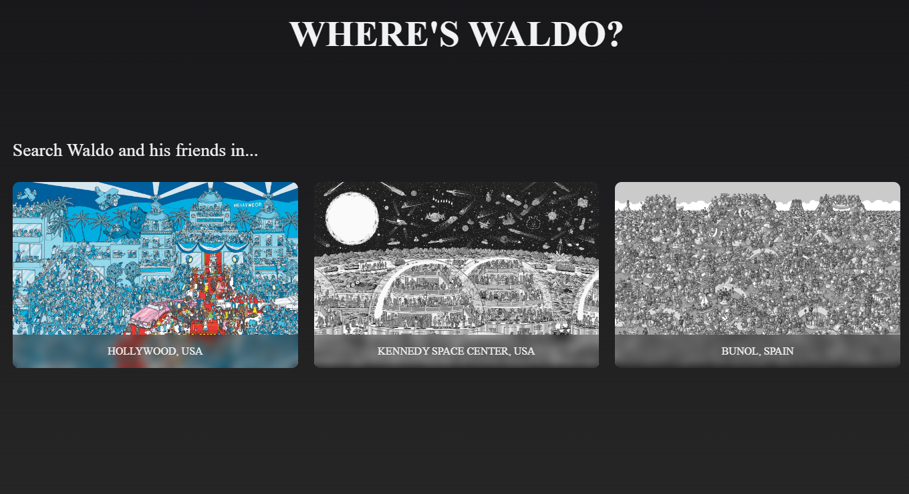
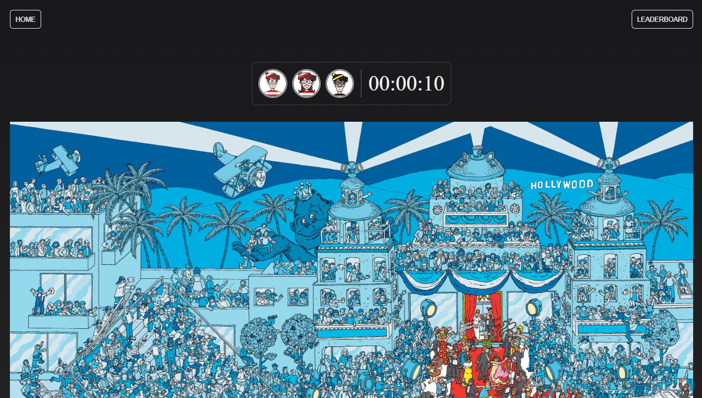

# Where's Waldo

The classic Where's Waldo aka Where's Wally built with React and Firebase for TheOdinProject.
A puzzle game where users solve puzzles by identifying characters within an image.

## Features

✧ Choose from a variety of puzzles to solve 
✧ A timer to track the time taken to solve the puzzle 
✧ A leaderboard displaying the fastest times for each puzzle 

## How to Play

**Select a Puzzle:** Choose a puzzle from the available options to play.

**Find Characters:** Locate the characters hidden within the puzzle.

**Identify Characters:** Click on the puzzle image to view character options.
Once a character is found, it's image will be grayed out!

**Complete the Puzzle:** Keep finding characters until all are found.

**Check Leaderboard:** View the leaderboard to compare solving times.

_NOTE: The timer will start automatically when the puzzle image finishes loading._

## Roadmap

- [ ] Give user feedback on their selection
- [ ] Enhance the leaderboard UI
- [ ] Add more puzzles

## Learnings

✧ Firebase Storage (used for storing puzzle images and Firestore for app data) 
✧ More about _useRef_ hook 
✧ Measuring elapsed time, particularly _performance.now()_ 
✧ Disabling scroll when modal is open (once again) 
✧ Making the modal container span the entire height of the page **regardless of the scroll position** 
✧ Reminded that event object returned by React is a SyntheticEvent, but we can access the native event using _e.nativeEvent_

## Preview

### Home

### Puzzle

## Demo

👉 [Live Demo](https://ruchita1010.github.io/where-is-waldo)
